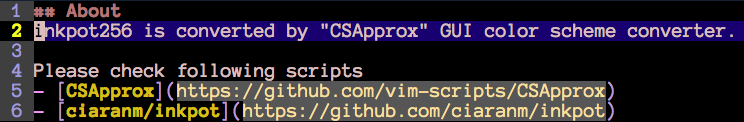

About
============================================================

inkpot256 is converted by "CSApprox" GUI color scheme converter.

Please check following scripts
- [CSApprox](https://github.com/vim-scripts/CSApprox)
- [ciaranm/inkpot](https://github.com/ciaranm/inkpot)
